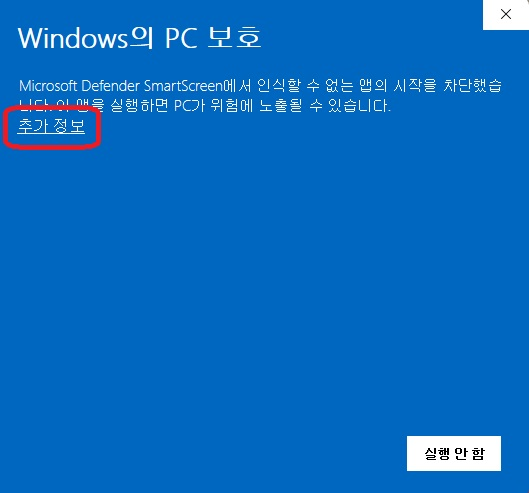

# 설치
**Karanda**는 웹과 Windows 데스크톱에서 실행할 수 있습니다.

## 웹에서 실행
웹 브라우저를 통해 **Karanda**에 접속할 수 있습니다.

```txt:no-line-numbers
https://www.karanda.kr
```

<LinkCard title="Karanda" href="https://www.karanda.kr" description="https://www.karanda.kr" />

### PWA
**Karanda**는 [Chrome](https://www.google.com/intl/ko_kr/chrome/) 브라우저를 통해 App처럼 사용할 수 있는 PWA를 설치할 수 있습니다. 플랫폼별 설치 방법은 [Chrome 도움말 센터](https://support.google.com/chrome/answer/9658361)에서 확인할 수 있습니다.

:::tip PWA란?
**PWA**는 **Progressive Web Apps**의 약자로 웹과 네이티브 앱의 기능 모두의 이점을 갖도록 수 많은 특정 기술과 표준 패턴을 사용해 개발된 웹 앱입니다.
:::

## Windows 데스크톱에서 실행
**Karanda**는 Windows11에서 빌드 및 테스트 되었습니다.

### 다운로드
최신 버전의 `SetupKaranda.exe`를 다운로드 합니다.

```txt:no-line-numbers
https://github.com/Hammuu1112/Karanda/releases/latest/download/SetupKaranda.exe
```

<LinkCard icon="line-md:download-outline-loop" title="SetupKaranda.exe" href="https://github.com/Hammuu1112/Karanda/releases/latest/download/SetupKaranda.exe" description="https://github.com/Hammuu1112/Karanda/releases/latest/download/SetupKaranda.exe" />

:::tip
이전 버전의 Release 또한 살펴볼 수 있습니다.
[https://github.com/Hammuu1112/Karanda/releases](https://github.com/Hammuu1112/Karanda/releases)
:::

### 설치
`SetupKaranda.exe`를 실행합니다.



**SmartScreen**이 뜨면 **추가 정보**를 눌러 실행하도록 합니다.

:::tip 왜 SmartScreen이 차단하나요?
**Karanda** 배포 패키지에는 코드 서명이 없으므로 위변조에 취약하기 때문입니다. 
**Karanda**를 다운로드 할 때에는 꼭 **Karanda 사이트** 또는 [karanda Github](https://github.com/Hammuu1112/Karanda)를 이용해주세요!!
:::

### 업데이트
**Karanda**는 실행 시 최신 버전 업데이트를 확인하며, 업데이트가 있을 경우 자동으로 진행합니다. **Karanda**를 최신버전으로 유지하기 위해서 주기적으로 **Karanda**를 재실행 하는게 좋습니다.

자동 업데이트가 진행되지 않을 경우에는 최신 버전의 설치 파일을 이용해 업데이트를 수동으로 진행할 수 있습니다.
설치 파일을 실행하면 기존 버전을 삭제하지 않더라도 새로운 버전으로 교체할 수 있습니다.
