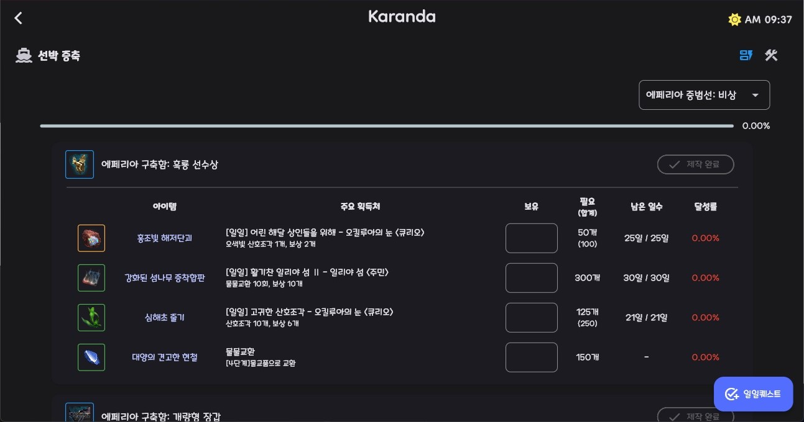

# 선박 증축

::: demo-wrapper img no-padding

:::

중범선 증축 재료 보유 현황을 기록하고 진행도를 시각적으로 확인할 수 있게 도와주는 서비스입니다. 해당 서비스는 로그인 없이 이용할 수 있으며, 입력 데이터는 로컬(사용자 장치)에 저장됩니다.

오른쪽 상단의 **<Icon name="material-symbols:dynamic-form-outline"/>(리스트 타입)** 버튼을 통해 증축 재료 리스트 또는 파츠별 필요 재료 리스트로 전환할 수 있습니다. 파츠별 재료 리스트로 볼 경우 각 재료의 **남은 일수**와 **달성률**은 해당 파츠에 필요한 양만 계산하므로 여러 파츠에 들어가는 재료일 경우에는 **합계** 항목을 통해 모든 파츠 제작에 필요한 갯수를 확인해야 합니다.

파츠별 필요 재료 리스트에서는 각 파츠의 **제작 완료** 버튼을 누르면 해당 파츠 제작에 필요한 재료는 모두 보유중인것으로 가정하고 달성률을 계산합니다.

재료가 모일때마다 파츠를 제작하는게 아니라 모두 모아서 한 번에 진행하시는 분들은 증축 재료 리스트로 보는게 좋습니다.

## 보유 재고 관리
각 재료의 보유 재고는 아래 3가지 방법으로 조절할 수 있습니다.
 - **텍스트 필드**에서 직접 수정
 - **아이템 이름** 버튼으로 1개 증가
 - **아이템 이미지** 버튼으로 1개 감소

보유 재고는 변화가 있을 때 마다 자동으로 저장되며, 여러 파츠에 들어가는 재료는 서로 동기화되어 있습니다.

## 일일퀘스트

오른쪽 하단의 **일일퀘스트** 버튼을 통해 일일퀘스트 한 번 분량의 재료를 한번에 추가할 수 있습니다. 헤당 기능을 사용하기 전에 일일퀘스트로 추가될 재료의 종류와 추가되는 갯수의 설정값을 미리 확인하는게 좋습니다. 

일일퀘스트에 대한 설정은 오른쪽 상단의 **<Icon name="material-symbols:construction"/>(설정)** 메뉴에서 진행할 수 있습니다.
